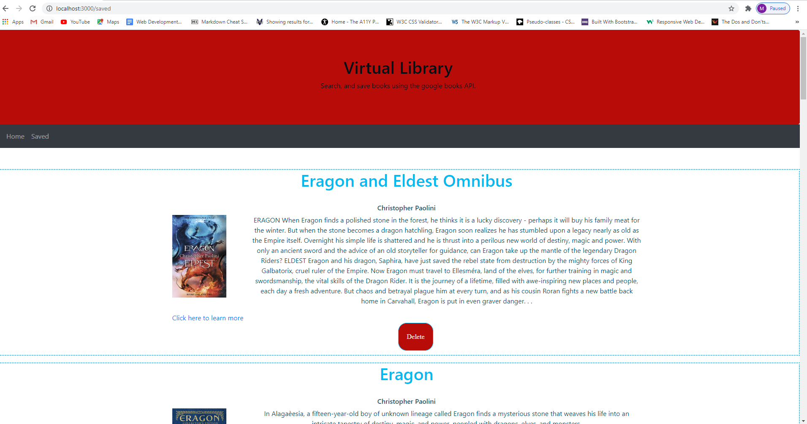

# Google-Book-List 

  

  ##  Description
  
  Search for books, and save favorites for later, using the google books API, and MongoDb.

  ## Table Of Contents

  * [Installation](#installation)
  * [Usage](#usage)
  * [Credits](#credits)
  * [License](#license)

  ## Installation

  npm i

  ## Usage

  Create a virtual library of books to read in the future.

  ## Credits

  N/A

  ## Test

    npm start after installation

  ## License

  MIT

## Questions

  for any questions or inquiries  please feel free to message me on Github at: https://github.com/marchandmr

  or you can send me an E-mail :  marchandmr@icloud.com

 

 
